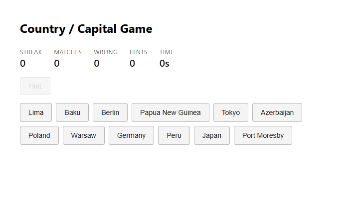
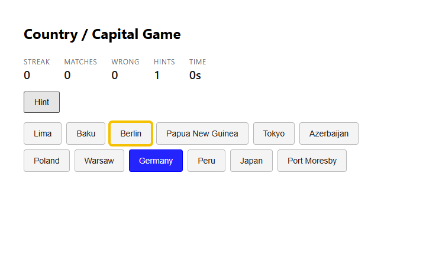
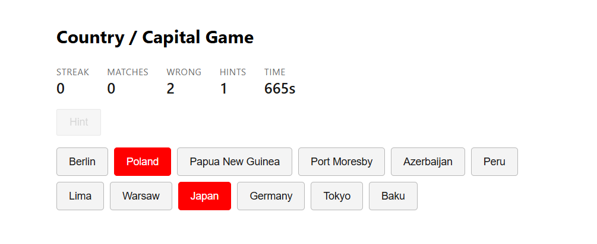
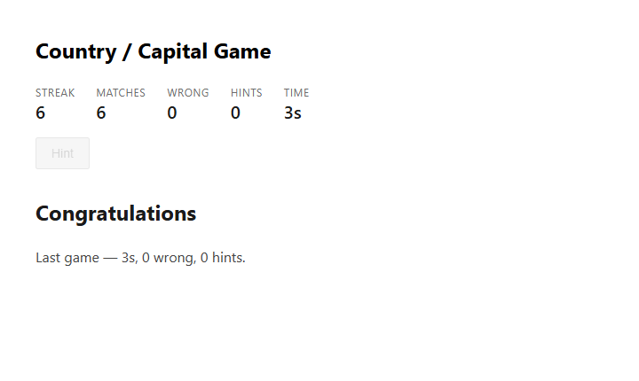

# Country / Capital Game

A country-and-capital matching game across three layers:

| Path | Part | Stack |
| --- | --- | --- |
| `legacy/` | 1 — fix & extend | AngularJS 1.8 |
| `frontend/` | 2 — rebuild | Angular 22 (standalone, signals, zoneless), Vitest |
| `api/` + `api-tests/` | 3 — backend | ASP.NET Core Web API (.NET 8), xUnit |
| `docs/` | 4 — evidence | end-to-end screenshots |

---

Start the **API first**, then the **Angular app** — the app talks to the API on
`http://localhost:5042`.

### Run the API (Part 3)

Needs the **.NET 8 SDK** (`dotnet --version` → 8.x). From the repo root:

```bash
cd api
dotnet run
```

Serves on `http://localhost:5042`; Swagger UI at `/`.

- `GET /api/game` → `200` with `{ "pairs": { "Germany": "Berlin", ... } }`
- `POST /api/game/results` with `{ "elapsedSeconds", "wrongAttempts", "hintsUsed" }` → `201`
  + `Location`; any negative or missing value → `400`.

Run the API tests:

```bash
cd api-tests
dotnet test
```

**In Visual Studio instead:** open `api/CountryCapitalApi.slnx` (VS 2022 17.13+; on older
versions open `api/CountryCapitalApi.csproj`), set **CountryCapitalApi** as the startup
project, pick the **http** launch profile, and press **F5**. Tests run from **Test
Explorer**; `api/CountryCapitalApi.http` hits the endpoints from the editor.

### Run the Angular app (Part 2)

Needs **Node 20+** (developed on Node 22). From the repo root:

```bash
cd frontend
npm install     # first run only
npm start       # ng serve → http://localhost:4200
```

(In VS Code, open the `frontend/` folder — it recommends the Angular Language Service
extension — and run the same commands in the integrated terminal.)

The dev server proxies `/api` to `http://localhost:5042` (`proxy.conf.json`), so the API
must be running for live data. Without it the board shows an error state with a
**Play offline** button that falls back to the `data` input.

**Tests (Vitest):**

```bash
npm test
```

### Legacy game (Part 1)

Open `legacy/game.html` directly in a browser — no build step.

---

## End-to-end

`docs/` holds a captured playthrough against the running API: the initial board, a hint
(gold), a wrong pair (red), and completion. The finished game emits
`{ elapsedSeconds, wrongAttempts, hintsUsed }` and `POST`s the same payload to
`/api/game/results`, which returns `201`.

| | |
| --- | --- |
|  |  |
|  |  |

---

## Part 3 — data source

**In-memory**, held by a singleton `GameService`.

The pair list is six fixed entries and the results endpoint only has to validate a
submission and accept it — nothing reads results back. A database (schema, migrations,
a connection to manage) would add moving parts without buying anything the assessment
asks for. Keeping it in one singleton also keeps a single source of truth for game data.

### Running across four load-balanced servers

In-memory results are per-process, so each node would hold only the submissions it
received and a restart would lose them. Move result storage to a shared store (SQL
Server or Redis) and keep the service stateless, so no sticky sessions are needed. Make
`POST /api/game/results` idempotent with a client-supplied id so a retry that lands on a
different node can't double-count. The `GET` dataset is static config and can stay
in-memory per node or move to shared config.

---

## Assumptions & trade-offs

- **Game state lives in a component-scoped `GameStateService`** (`providers: [...]` on the
  component, not `root`), so each mounted game owns its state and the rules sit in one
  place. `GameApiService` stays a thin HTTP wrapper.
- **The fetch error state is explicit and recoverable** — a message plus **Retry** and
  **Play offline** (the latter uses the `data` input) — rather than silently swallowing
  the failure.
- **Hint** is enabled only while exactly one *country* is selected, matching the spec
  ("the correct capital for the country currently selected"). It highlights the partner
  for 2s; the timer is cleared on the next click, on a repeat hint, and on component
  destroy.
- A **matches** counter sits alongside the required streak / wrong / hints / time — it is
  the Part 1 score carried over, and cheap to keep.
- No deployment: local instructions plus the `docs/` screenshots.
- API results are kept in a `ConcurrentQueue` for the process lifetime — enough to prove
  the endpoint; see the four-server note above for production.

---

## Part 4 — reflection

**If this were a 4-hour ticket instead of 8, what would I cut first?**
The polish that isn't load-bearing. I'd drop the "Play offline" fallback affordance, the
`matches` counter, and most of the test breadth — keeping the rule-engine tests plus one
HTTP state test and cutting the rest — and I'd shorten the four-server note to two lines. The
game's rule engine and the API contract are what's actually being assessed; infrastructure
and exhaustive coverage have the lowest marginal value under time pressure. I'd still keep
signals, OnPush, the new control flow, DTOs and validation, because those are cheap when
done from the start and expensive to retrofit.

**The one Part 1 thing I'd fix if I owned it long-term, and what I'd leave alone.**
Fix: the controller writing the win message straight to the DOM with
`document.getElementById`. It skips Angular's digest, couples the controller to the
markup, and makes the end state untestable without a real DOM — and once one controller
reaches for `document`, others follow. It should set a scope property the template binds.
Leave alone: the `buildButtons` / `shuffle` id-prefix scheme (`'c-'` / `'k-'`, in-place
shuffle). It's crude but self-contained and correct, so rewriting it is pure regression
risk for no user-visible gain.

